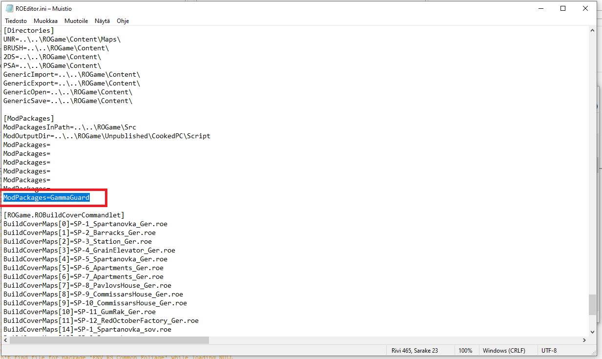
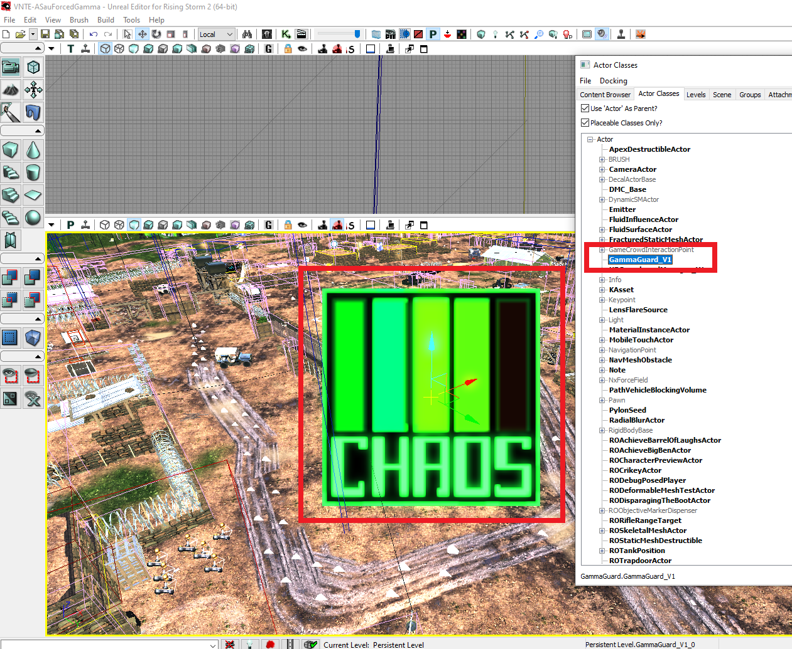
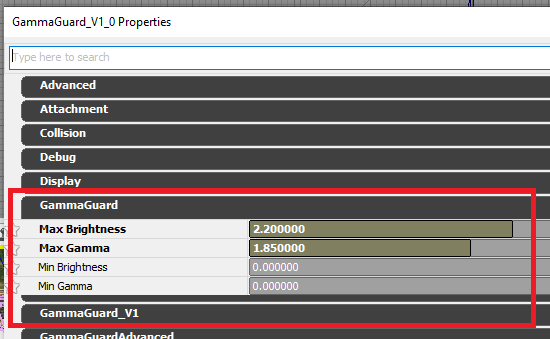
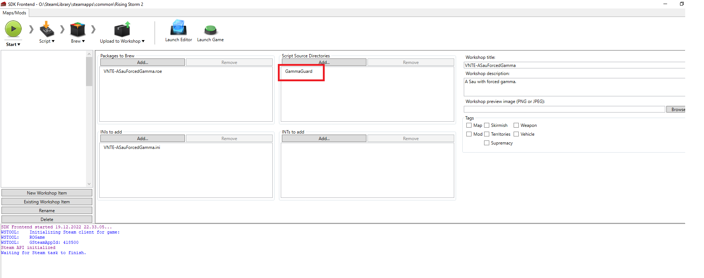

# RS2 Gamma Guard

GammaGuard is an actor for Rising Storm 2: Vietnam that can be placed on any level.

Periodically checks gamma and brightness force clamps them to a certain range set by the level designer.

https://steamcommunity.com/sharedfiles/filedetails/?id=2901881626

## Usage instructions

1. Download the source code from this GitHub repository.
Place it in `Documents\My Games\Rising Storm\ROGame\Src\GammaGuard`.

2. Add the required `ModPackages=GammaGuard` entry in your `ROEditor.ini` file.

3. Open the editor to trigger a script compilation. There should be a prompt
asking if you want to build scripts. Click yes.
After compiling the source code, the GammaGuard actor will be visible in
your editor's Actor Classes menu.

4. Add the actor in your map and play around with these values
until you are happy.

5. Upload your map to workshop with the required script source directory selected.

